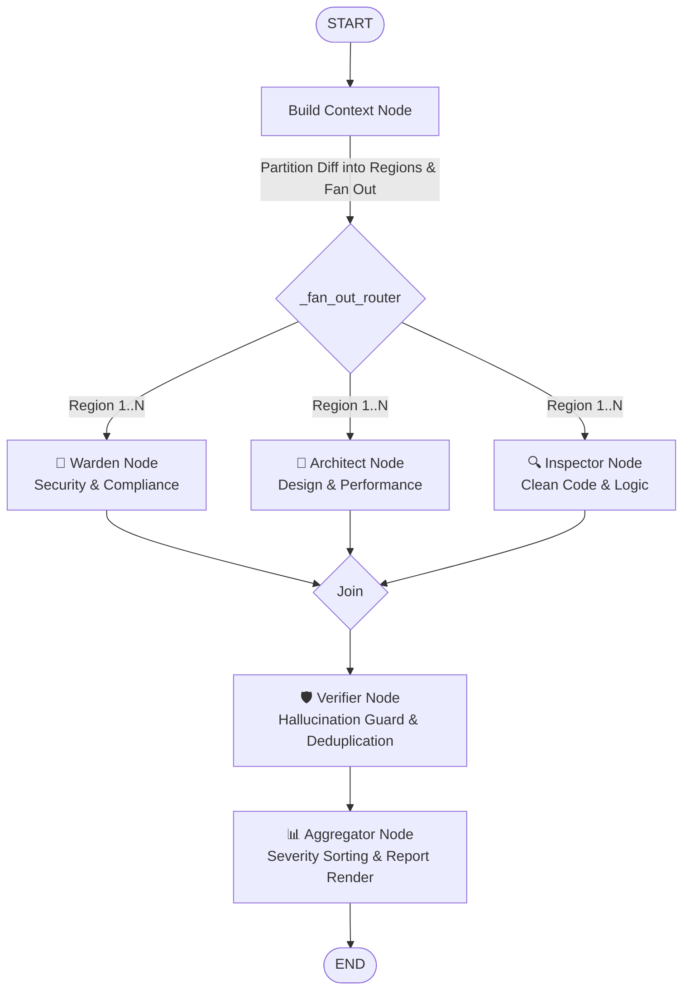

# 🌈 Prism Reviewer

Prism Reviewer is an agentic, AI-driven multi-agent code review system orchestrated via [LangGraph](https://github.com/langchain-ai/langgraph) and [LiteLLM](https://github.com/BerriAI/litellm). It acts as an autonomous gatekeeper for pull requests by performing targeted static analysis, dependency scanning, AST-based symbol inspection, and parallel LLM-guided code evaluation.

---

## 📖 Table of Contents
1. [🔍 System Description](#1-system-description)
2. [📐 Architecture and Flow](#2-architecture-and-flow)
3. [🧠 Key Intricacies and Design Decisions](#3-key-intricacies-and-design-decisions)
4. [🔧 Installation](#4-installation)
5. [📦 Packaging and Distribution](#5-packaging-and-distribution)
6. [💻 CLI Usage](#6-cli-usage)
7. [🔩 Configuration Guide](#7-configuration-guide)
8. [🔌 Running Reviews Locally via GitHub PR ID](#8-running-reviews-locally-via-github-pr-id)
9. [🔗 GitHub App and Integration Setup](#9-github-app-and-integration-setup)
10. [📝 Notes Limitations and Roadmap](#10-notes-limitations-and-roadmap)
11. [Why Prism Reviewer? 🌈](#11-why-prism-reviewer)

---

## 🔍1. System Description

Prism Reviewer splits a single code changes delta (git diff) into specialized analytical spectrums using an Agent Council. Instead of sending a monolithic prompt to a single LLM, it routes structural, security, and tactical code context in parallel to three distinct agent roles. Combined with the local AST syntax trees, dependency warnings, and usage reference searches, it compiles a rigorous, context-aware code review report categorized by severity.

### Key Features
- **Deterministic Evaluation**: Supports zero temperature, fixed seed routing, and structured JSON output to eliminate probabilistic drift across runs.
- **AST CodeLens Map**: Leverages Tree-Sitter grammars (supporting Python, Java, TypeScript, JavaScript, C, C++, Go, and Rust) to extract class, function, and method ranges before scanning.
- **Dependency Warnings**: Scans requirements files (`requirements.txt`, `package.json`, `pyproject.toml`) for dependency configuration anomalies.
- **Map-Reduce Parallelism**: Orchestrated through a LangGraph `StateGraph`, enabling concurrent LLM agent queries.
- **Dual-Safeguard Verification**: Fact-checks and filters findings against changed lines and previous review states to ensure zero hallucinations and zero duplication.

---

## 📐2. Architecture and Flow

The review execution lifecycle is modeled as a LangGraph workspace map-reduce graph, organized as follows:



### Flow Execution Steps:
1. **`build_context_node`** (implemented in [nodes.py](src/prism_reviewer/agents/nodes.py)): Gathers directory profiles, runs AST scans on modified files, scans dependencies, parses usage references, and slices large diffs into logical regions.
2. **`_fan_out_router`** (implemented in [graph.py](src/prism_reviewer/agents/graph.py)): Routes each region to all three agent nodes concurrently.
3. **Agent Council**:
   - 👮 **Warden Node**: Evaluates vulnerabilities, exposed credentials, loose dependencies, and data leaks.
   - 📐 **Architect Node**: Audits architectural design, design pattern compliance, performance traps (like N+1 queries), and scale limitations.
   - 🔍 **Inspector Node**: Targets clean code compliance, readability, minor logic bugs, and syntax smells.
4. **`verifier_node`** (implemented in [verifier.py](src/prism_reviewer/agents/verifier.py)): Performs double-guard filtering (hallucination checks & duplicate suppression).
5. **`aggregator_node`** (implemented in [aggregator.py](src/prism_reviewer/agents/aggregator.py)): Sorts findings by severity (CRITICAL &rarr; MAJOR &rarr; ADVISORY) and renders the report.

---

## 🧠3. Key Intricacies and Design Decisions

### 3.1 Large PR Region Partitioning
Large code deltas exceed single-turn LLM context limits or result in degraded review quality. Prism Reviewer slices large diffs into localized, file-level regions based on line count constraints (configured by `max_region_lines`). The router fans out separate state objects per region to the agent council. LangGraph automatically gathers and aggregates the findings once all region runs complete.

### 3.2 The Dual-Safeguard Verifier
- **Hallucination Guard**: Generative agents may comment on files or line numbers that do not exist or were not modified. The verifier compiles a precise index of modified `(filename, line_number)` pairs from the raw git diff. Any finding pointing to a line outside this set is dropped.
- **Idempotent Deduplication**: Running reviews continuously on every synchronization push can overwhelm developers with duplicate warnings on unchanged code blocks. The system computes a content-hash signature for each finding based on the file path, line number, agent type, and the surrounding diff content. These signatures are stored in [signatures.json](.prism_reviewer/signatures.json). Subsequent runs skip findings with matching signatures.

### 3.3 Buffered Atomic Logging
Standard terminal log writers interleave messages when multiple threads execute in parallel. To preserve clean CLI logs, Prism Reviewer implements `NodeLogger` (defined in [nodes.py](src/prism_reviewer/agents/nodes.py)). This class buffers per-agent log entries in memory and flushes them as a single atomic log block on node completion.

---

## 🔧4. Installation

To install Prism Reviewer in editable mode for local development:
```bash
pip install -e .
```

To install with development dependencies (e.g., for running the test suite):
```bash
pip install -e ".[dev]"
```

---

## 📦5. Packaging and Distribution

Prism Reviewer is packaged using standard Python packaging utilities and `setuptools` (configured in `pyproject.toml`).

### 5.1 Build Prerequisites
Before building your distribution packages, ensure you have the python build modules `build` and `twine` installed:
```bash
pip install --upgrade build twine
```

### 5.2 Building the Distribution Packages
From the root directory of the repository (where `pyproject.toml` is located), execute the build wrapper to compile the source distribution tarball (`.tar.gz`) and Python wheel binary (`.whl`):
```bash
python -m build
```
This command compiles and outputs the distribution assets into the `dist/` directory.

### 5.3 Uploading to TestPyPI
To verify that the package parses and installs correctly without affecting production indices, publish your packages to the TestPyPI repository:
```bash
python -m twine upload --repository testpypi dist/*
```
When prompted, log in using the username `__token__` and your corresponding TestPyPI API token as the password.

### 5.4 Uploading to PyPI
Once testing succeeds, release the verified distribution packages directly to the production Python Package Index (PyPI):
```bash
python -m twine upload dist/*
```
Log in using the username `__token__` and your production PyPI API token as the password.

### 5.5 Automated TestPyPI Publishing via GitHub Actions
Whenever a new GitHub release is published, the repository automatically builds and publishes the package to TestPyPI via the [publish-testpypi.yml](.github/workflows/publish-testpypi.yml) workflow.

To enable publication, configure one of the following authentication methods on GitHub:
- **PyPI Trusted Publishing (OIDC - Recommended)**: Configure a Trusted Publisher on [test.pypi.org](https://test.pypi.org) matching your GitHub repository (`vyoman-labs/prism-reviewer`), workflow file `publish-testpypi.yml`, and environment name `testpypi`.
- **API Token Fallback**: Alternatively, add a GitHub repository secret named `TEST_PYPI_API_TOKEN` containing your TestPyPI API token.

---

## 💻6. CLI Usage

You can invoke the review agent via the registered CLI executable:
```bash
prism-review --pr --repo /path/to/your/repo --base main
```

Or execute it as a Python module:
```bash
python -m prism_reviewer.cli --pr --repo /path/to/your/repo --base main
```

### 6.1 CLI Command Options

| Argument | Type | Description |
| --- | --- | --- |
| `--pr` | Flag | Runs the core Prism Reviewer agentic process. |
| `--repo` | Path | Path to the target repository (defaults to the current working directory). |
| `--base` | String | Base branch or commit for git comparison (defaults to `unstaged`). |
| `--diff` | String | Optional. Prints local git diff. Values: `unstaged` (default), `staged`, or specific commit. |
| `--structure` | Flag | Displays the directory structure of tracked files in JSON format. |
| `--scan-deps` | Flag | Scans project manifests (`requirements.txt`, `package.json`, `pyproject.toml`). |
| `--search` | String | Run regex search query across files. |
| `--methods` | Path | Extracts AST symbols (classes, functions, methods) from the target file. |
| `--context` | Path | Optional. Path to custom project context markdown file (defaults to `.prism_reviewer/context.md`). |
| `--rules` | Path | Optional. Path to custom repository review rules markdown file (defaults to `.prism_reviewer/rules.md`). |

---

## 🔩7. Configuration Guide

Prism Reviewer uses a centralized config system driven by [prism_reviewer.toml](prism_reviewer.toml). Placing a `prism_reviewer.toml` in your repository root is optional—if omitted, Prism Reviewer automatically falls back to built-in package defaults. Numeric parameters are dynamically cast, and environment variable overrides are supported using the `${VAR_NAME|-default_value}` format. You can define environment variables in a `.env` file (see `.env.example`) in your project root or pass them via shell environment variables.

### 7.1 Configuration Properties

#### 7.1.1 GitHub Configuration `[github]`
| Parameter | Default / Placeholder | Description |
| --- | --- | --- |
| `token` | `${GITHUB_TOKEN}` | GitHub Personal Access Token or Installation Token. |

#### 7.1.2 Core LLM Configuration `[llm]`
| Parameter | Default / Placeholder | Description |
| --- | --- | --- |
| `api_key` | `${LLM_PROVIDER_API_KEY}` | API credential key for the LiteLLM backend. |
| `model` | `${LLM_MODEL_OVERRIDE}` | Target model identifier used for all agents (e.g., `openai/gpt-4o`, `anthropic/claude-3-5-sonnet`). |

#### 7.1.3 Throttling and Resilience `[llm.thresholds]`
| Parameter | Default / Placeholder | Description |
| --- | --- | --- |
| `max_requests_per_minute` | `${MAX_REQUESTS_PER_MINUTE\|-60}` | API rate throttle limit per minute. |
| `max_concurrent_requests` | `${MAX_CONCURRENT_REQUESTS\|-10}` | Max parallel connections allowed. |
| `retries` | `${RETRIES\|-5}` | Number of backoff attempts on connection failures. |
| `backoff_seconds` | `${BACKOFF_SECONDS\|-30}` | Exponential retry multiplier factor. |

#### 7.1.4 Agent Execution Options `[agents]`
| Parameter | Default / Placeholder | Description |
| --- | --- | --- |
| `mode` | `${AGENTS_MODE\|-parallel}` | Executes agent council in `parallel` or `sequential` mode. |
| `max_region_lines` | `${MAX_REGION_LINES\|-500}` | Maximum lines per git diff slice region. |
| `max_readme_chars` | `${MAX_README_CHARS\|-10000}` | Maximum characters of root `README.md` included in review context. |

#### 7.1.5 Cognitive Reasoning Settings `[agents.reasoning_effort]`
| Agent | Default / Placeholder | Description |
| --- | --- | --- |
| `warden` | `${WARDEN_REASONING_EFFORT\|-high}` | AppSec audits benefit from deep cognitive reasoning. |
| `architect` | `${ARCHITECT_REASONING_EFFORT\|-medium}` | Evaluates structural coupling and performance traps. |
| `inspector` | `${INSPECTOR_REASONING_EFFORT\|-medium}` | Evaluates local variable smells and code readabilities. |
| `verifier` | `${VERIFIER_REASONING_EFFORT\|-low}` | Mechanical validation requires minimal reasoning. |

#### 7.1.6 Per-Agent Model Overrides `[agents.models]`
| Agent | Default / Placeholder | Description |
| --- | --- | --- |
| `warden` | `${WARDEN_MODEL_NAME}` | Custom model name for the Warden agent. |
| `architect` | `${ARCHITECT_MODEL_NAME}` | Custom model name for the Architect agent. |
| `inspector` | `${INSPECTOR_MODEL_NAME}` | Custom model name for the Inspector agent. |
| `verifier` | `${VERIFIER_MODEL_NAME}` | Custom model name for the Verifier agent. |

---

### 7.2 Project Context & Custom Review Rules (`.prism_reviewer/`)

Prism Reviewer allows repository maintainers to significantly improve review quality, domain accuracy, and signal-to-noise ratio by supplying optional **Project Context** (`context.md`) and **Custom Review Rules** (`rules.md`).

When reviewing pull requests, the multi-agent council (Warden, Architect, Inspector) loads these files into prompt memory to evaluate code changes against your team's exact architectural standards, domain concepts, and coding policies.

#### 7.2.1 Directory Structure
Place these markdown files inside a `.prism_reviewer/` directory at the root of your target repository:
```
my-repository/
├── .prism_reviewer/
│   ├── context.md   # Project architecture, tech stack & domain background
│   └── rules.md     # Custom coding rules, security requirements & constraints
├── prism_reviewer.toml
└── ...
```

> [!TIP]
> Both `.prism_reviewer/context.md` and `.prism_reviewer/rules.md` are **automatically auto-detected** by the CLI (`prism-review`) and local execution script (`run_local.py`). You can also specify custom file locations using the `--context` and `--rules` flags.

#### 7.2.2 Project Context (`.prism_reviewer/context.md`)
Providing high-level background information helps agents understand design intentions, domain models, and system boundaries rather than flagging intentional design decisions.

**Recommended Contents:**
- **System Overview & Architecture**: Core purpose, key subsystems, database layers, and external service dependencies.
- **Tech Stack & Libraries**: Framework versions, state management tools, ORMs, and async models.
- **Design Conventions**: Preferred design patterns (e.g., repository pattern, dependency injection), immutability rules, or concurrency patterns.

*Example `context.md`:*
```markdown
# Project Context: Payment Processing Service

## Architecture
- Microservice built with FastAPI, PostgreSQL, and Celery worker queues.
- Uses SQLAlchemy 2.0 with async sessions.

## Key Invariants
- All monetary values must be represented using integer cents or Decimal to avoid floating-point errors.
- Payment gateway API calls must be wrapped in idempotent retry blocks.
```

#### 7.2.3 Custom Review Rules (`.prism_reviewer/rules.md`)
Repository-specific rules allow you to enforce team coding standards, security boundaries, and strict review constraints.

**Recommended Contents:**
- **Security Constraints**: Forbidden functions (e.g., `eval`, un-sanitized SQL formatting), credential leakage checks, CORS policies.
- **Performance & Scaling Rules**: N+1 query prevention, missing database index warnings, memory leak checks.
- **Code Style & Maintainability**: Maximum function length guidelines, docstring requirements, error handling requirements (e.g., no bare `except:` clauses).

*Example `rules.md`:*
```markdown
# Repository Review Rules

## Security & Reliability
- NEVER execute raw SQL queries constructed via string formatting or f-strings. Use parameterized queries.
- Ensure all public API endpoints handle exceptions explicitly and return structured JSON error models.

## Code Quality & Performance
- Do not make database calls inside loops (N+1 query anti-pattern). Use batch loading or eager joins.
- All newly added functions must include static type annotations for arguments and return values.
```

---

## 🔌8. Running Reviews Locally via GitHub PR ID

To execute pull request reviews locally using a GitHub Pull Request ID, Prism Reviewer provides a pre-configured utility script: [run_local.py](scripts/run_local/run_local.py). This script fetches the diff, title, and description for a remote PR, executes the Agent Council review locally, and writes the output report.

### 8.1 Execution Command
```bash
python scripts/run_local/run_local.py --repo "owner/repository" --pr 42 --token "YOUR_GITHUB_TOKEN"
```

### 8.2 Command Options
- `--repo`: The full name of the repository on GitHub (e.g., `octocat/Hello-World`).
- `--pr`: The numeric ID of the Pull Request.
- `--token`: Your GitHub Personal Access Token (PAT). If not provided, it falls back to the `GITHUB_TOKEN` environment variable.
- `--output`: Filepath to write the Markdown report (defaults to `prism_review_report.md`).

---

## 🔗9. GitHub Integration & GitHub Action Setup

Prism Reviewer can be integrated into any GitHub repository using our official GitHub Action or as a GitHub App integration.

---

### 9.1 External Repository Quickstart (Using GitHub Action)

External repositories can run automated AI code reviews on Pull Requests in **3 simple steps** using our GitHub Action (`vyoman-labs/prism-reviewer@v1`).

#### Step 1: Add your LLM Provider API Key Secret
In your repository, go to **Settings > Secrets and variables > Actions > New repository secret** and add:
- **`LLM_PROVIDER_API_KEY`**: Your API key for Gemini, OpenRouter, OpenAI, Anthropic, or any LiteLLM-supported provider.

#### Step 2: Create Workflow File
Create a file named `.github/workflows/prism-reviewer.yml` in your repository (or copy [docs/examples/prism-reviewer-external.yml](docs/examples/prism-reviewer-external.yml)):

```yaml
name: Prism Reviewer AI Code Review

on:
  pull_request:
    types: [opened, synchronize, reopened]

permissions:
  contents: read
  pull-requests: write

jobs:
  review:
    name: Run AI Code Review
    runs-on: ubuntu-latest
    steps:
      - name: Checkout Codebase
        uses: actions/checkout@v4
        with:
          fetch-depth: 0 # Fetch all history for git diff comparison

      - name: Run Prism Reviewer AI
        uses: vyoman-labs/prism-reviewer@v1
        with:
          llm-api-key: ${{ secrets.LLM_PROVIDER_API_KEY }}
```

#### Step 3: Open a Pull Request
Open or update any Pull Request. Prism Reviewer will automatically analyze your code changes and post a structured review report directly to the PR comments!

---

### 9.2 Action Inputs Reference

| Input | Required | Default | Description |
| :--- | :--- | :--- | :--- |
| `llm-api-key` | **Yes** | — | API key for LiteLLM provider (Gemini, OpenRouter, OpenAI, etc.). |
| `llm-model-name` | No | `gemini/gemini-3.1-flash-lite` | Model identifier to execute analysis. |
| `github-token` | No | `${{ github.token }}` | Token used to post review comments. |
| `base-ref` | No | `${{ github.base_ref }}` | Base branch for git diff comparison. |
| `agents-mode` | No | `parallel` | Agent execution mode (`parallel` or `sequential`). |

---

### 9.3 Customizing Bot Comment Identity

By default, comments are posted under the standard **`github-actions[bot]`** identity with a prominent **`🌈 Prism Reviewer AI`** report header inside the comment body.

If you prefer comments to be posted under a dedicated **GitHub App Bot Name** (e.g. `Prism Reviewer AI[bot]`):

```yaml
      - name: Generate App Token
        id: app-token
        uses: actions/create-github-app-token@v1
        with:
          app-id: ${{ secrets.PRISM_REVIEWER_APP_ID }}
          private-key: ${{ secrets.PRISM_REVIEWER_PRIVATE_KEY }}

      - name: Run Prism Reviewer AI
        uses: vyoman-labs/prism-reviewer@v1
        with:
          github-token: ${{ steps.app-token.outputs.token }}
          llm-api-key: ${{ secrets.LLM_PROVIDER_API_KEY }}
```

---

### 9.4 GitHub App & Webhook Setup

To configure a dedicated GitHub App registration or webhooks for the Prism Reviewer Dashboard, see the detailed documentation:
- [GitHub App Setup Guide](docs/github_app_setup.md)
- [GitHub Integration Overview](docs/github_setup.md)


---

## 📝10. Notes Limitations and Roadmap

### 10.1 Limitations
- **Syntax Boundaries**: AST CodeLens mappings support Python (`.py`), Java (`.java`), TypeScript (`.ts`, `.tsx`), JavaScript (`.js`, `.jsx`), C (`.c`), C++ (`.cpp`, `.cc`, `.cxx`, `.h`, `.hpp`), Go (`.go`), and Rust (`.rs`) via tree-sitter. Other file types fall back to plain-text indexing.
- **Git Dependency**: The core analysis tool relies on local system execution of the `git` executable (specifically `git diff` and `git ls-files`).
- **LLM Rate Limits**: Parallel map-reduce execution can exceed rate limits on standard API tiers. Throttling is managed via LiteLLM configurations in [prism_reviewer.toml](prism_reviewer.toml).

### 10.2 Project Roadmap
- Expand AST grammar coverage to additional languages as needed.
- Integrate directly with GitHub **Check Runs API** to highlight warnings inline inside the GitHub "Files changed" diff viewer.
- Create an interactive **CLI review wizard** allowing developer queries directly in the terminal.
- Provide a Dockerized workspace image for zero-dependency CI installations.

---

## 🌈11. Why Prism Reviewer?

In optics, a **prism** separates white light into a colorful spectrum of wavelengths.

Prism Reviewer applies the same optical concept to code review:
1. **Splitting the Spectrum**: It takes a single unified Pull Request delta and refracts it into three distinct analytical bands: **Warden** (Security), **Architect** (Structure & Performance), and **Inspector** (Clean Code & Logic).
2. **Filtering the Wavelengths**: The verification layer filters these individual bands, blocking noise (hallucinations) and redundant repeats (deduplication).
3. **Recomposing the Light**: The aggregator recombines these analyzed results back into a single clear, actionable markdown review report.

By decomposing and refocusing the code review process, Prism Reviewer ensures that every angle of your codebase receives the specialized focus it deserves.
