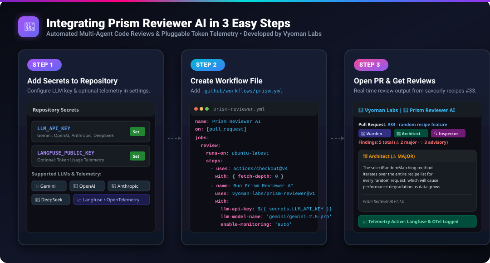

# Why Most AI Code Reviewers Fail (And How Multi-Agent Architecture Fixes It)

*By Vyoman Labs • Announcing Prism Reviewer v1.1.0*

---



## The Pull Request Crisis in Modern Software Teams

Every software team hits the exact same wall as they scale: **Pull Request Bottlenecks**. 

Developers spend hours context-switching away from deep work to review PRs. Senior engineers get burnt out wading through 500-line diffs, missing subtle security leaks or edge-case logic bugs while spending mental bandwidth pointing out style nits. 

When teams tried solving this with first-generation "AI Code Reviewers"—single-prompt LLM wrappers that dump git diffs into a chat prompt—they quickly hit four major dealbreakers:

1. **Hallucinated Comments on Wrong Lines**: The AI comments on lines that weren't even changed in the PR, confusing developers and destroying trust.
2. **Exploding & Unmonitored Token Bills**: Sending the full 2,000-line PR context on *every single git push* burns through hundreds of dollars in API credits without any visibility into token usage or cost tracking.
3. **Noisy Nitpicks & Monolithic Thinking**: A single prompt trying to evaluate security, architecture, performance, formatting, and syntax all at once yields generic, surface-level advice.

To fix code review for good, we built **[Prism Reviewer](https://github.com/vyoman-labs/prism-reviewer)**: an open-source, multi-agent AI code review engine orchestrated with **LangGraph** and **LiteLLM**.

---

## What Makes Prism Reviewer Different?

Rather than treating code review as a single text-completion task, Prism Reviewer breaks down code review into a specialized spectrum of agent capabilities:

```
                  ┌──────────────────────────────────────────┐
                  │           Git Diff / PR Event            │
                  └────────────────────┬─────────────────────┘
                                       │
                                       ▼
                  ┌──────────────────────────────────────────┐
                  │    Tree-Sitter AST CodeLens & Router     │
                  └────────────────────┬─────────────────────┘
                                       │
                 ┌─────────────────────┼─────────────────────┐
                 │ (Parallel Fan-Out)  │                     │
                 ▼                     ▼                     ▼
        ┌──────────────────┐  ┌──────────────────┐  ┌──────────────────┐
        │  👮 Warden Node  │  │ 📐 Architect Node│  │🔍 Inspector Node │
        │ Security & Leak  │  │ Design & Perform │  │ Code Logic & AST │
        └────────┬─────────┘  └────────┬─────────┘  └────────┬─────────┘
                 │                     │                     │
                 └─────────────────────┼─────────────────────┘
                                       │
                                       ▼
                  ┌──────────────────────────────────────────┐
                  │   🛡️ Dual-Safeguard Verifier Node       │
                  │   (Hallucination Index & Deduplicator)   │
                  └────────────────────┬─────────────────────┘
                                       │
                                       ▼
                  ┌──────────────────────────────────────────┐
                  │ 📈 Pluggable Telemetry (Langfuse/OTel)   │
                  │    Tracks Token Usage, Cost & Latency    │
                  └────────────────────┬─────────────────────┘
                                       │
                                       ▼
                  ┌──────────────────────────────────────────┐
                  │    📊 GitHub PR Review Report Render     │
                  └──────────────────────────────────────────┘
```

### 1. The Multi-Agent Council
Prism Reviewer routes diff regions in parallel across three distinct LLM agent personas:
- 👮 **Warden Node**: Dedicated strictly to security vulnerabilities, hardcoded credentials, dependency risks, and compliance checks.
- 📐 **Architect Node**: Audits system design, architectural patterns, algorithmic efficiency, and structural debt.
- 🔍 **Inspector Node**: Focuses on code cleanliness, logic bugs, AST symbol usage, and readability.

### 2. Smart Hybrid Incremental Review (Up to 90% Token Reduction)
When a developer pushes a small 10-line commit to an existing PR, naive tools re-read the entire branch diff. Prism Reviewer’s **Smart Hybrid Engine** compares only `previous_sha..HEAD` for LLM analysis while preserving full PR context via AST symbol maps and past `MAJOR`/`CRITICAL` comment threads. This cuts token consumption by up to **90%** on PR updates!

### 3. Pluggable Telemetry & Token Usage Monitoring (Langfuse & OpenTelemetry)
Enterprise teams require total observability over AI spending and token efficiency. Prism Reviewer features built-in **pluggable telemetry callbacks**:
- **Langfuse Integration**: Pass `LANGFUSE_PUBLIC_KEY` and `LANGFUSE_SECRET_KEY` as environment variables to automatically log prompt tokens, completion tokens, latency breakdown per agent, and exact LLM API costs.
- **OpenTelemetry (OTel)**: Set `OTEL_EXPORTER_OTLP_ENDPOINT` to export token usage metrics and traces straight to Datadog, New Relic, Grafana, or Honeycomb.
- **Zero-Code Package Auto-Detection**: Prism Reviewer automatically detects telemetry keys and installs required monitoring SDKs conditionally (`enable-monitoring: auto`).

### 4. Dual-Safeguard Verifier (Zero Hallucination Guarantee)
Before any review comment is published to GitHub:
- **Hallucination Indexing**: Prism Reviewer compiles an exact mathematical index of modified `(filename, line_number)` tuples from the raw git diff. Any comment targeting an un-modified line is automatically filtered out.
- **Idempotent Content-Hash Deduplication**: Using sha256 signatures of diff context and findings, Prism Reviewer prevents duplicate comments across push updates.

### 5. Any LLM Provider via LiteLLM
Whether your team prefers **Gemini 2.5 Pro / Flash**, **OpenAI GPT-4o**, **Anthropic Claude 3.7 Sonnet**, **DeepSeek R1/V3**, or local **Ollama** models, Prism Reviewer supports them seamlessly via LiteLLM configuration.

---

## 3-Minute GitHub Action Setup

Integrating Prism Reviewer into your repository requires just **3 simple steps**:

### Step 1: Add Secrets
Go to **Settings &rarr; Secrets and variables &rarr; Actions** in your GitHub repository and add:
- `LLM_API_KEY`: Your key for Gemini, OpenAI, Anthropic, or DeepSeek.
- *(Optional)* `LANGFUSE_PUBLIC_KEY` & `LANGFUSE_SECRET_KEY`: Enable live token usage & cost monitoring dashboards.

### Step 2: Create Workflow File
Create `.github/workflows/prism-reviewer.yml`:

```yaml
name: Prism Reviewer AI

on:
  pull_request:
    types: [opened, synchronize, reopened]

jobs:
  review:
    runs-on: ubuntu-latest
    permissions:
      contents: read
      pull-requests: write

    steps:
      - name: Checkout Code
        uses: actions/checkout@v4
        with:
          fetch-depth: 0

      - name: Run Prism Reviewer AI
        uses: vyoman-labs/prism-reviewer@v1
        with:
          llm-api-key: ${{ secrets.LLM_API_KEY }}
          llm-model-name: 'gemini/gemini-2.5-pro'  # Or 'openai/gpt-4o', 'anthropic/claude-3-7-sonnet'
          enable-monitoring: 'auto'                # Auto-installs telemetry for Langfuse/OTel when keys are present
        env:
          LANGFUSE_PUBLIC_KEY: ${{ secrets.LANGFUSE_PUBLIC_KEY }}
          LANGFUSE_SECRET_KEY: ${{ secrets.LANGFUSE_SECRET_KEY }}
```

### Step 3: Open a Pull Request!
The next time any developer opens or updates a PR, the Prism Reviewer Agent Council automatically analyzes the code, posts high-signal review comments, and logs token telemetry to your monitoring dashboard.

---

## Summary & Open Source Link

AI code review shouldn't mean noisy nitpicks, line hallucinations, or unmonitored cloud bills. By pairing **Tree-Sitter AST parsing** with **LangGraph multi-agent orchestration**, **Langfuse/OTel token monitoring**, and **zero-hallucination verification**, Prism Reviewer delivers enterprise-grade code gatekeeping in a 3-minute setup.

- 🌟 **GitHub Repository**: [vyoman-labs/prism-reviewer](https://github.com/vyoman-labs/prism-reviewer)
- 📦 **GitHub Marketplace**: [Prism Reviewer AI](https://github.com/marketplace/actions/prism-reviewer-ai)
- 🔍 **Live Demo PR**: See real Prism Reviewer comments in action on [savourly-recipes PR #33](https://github.com/aravinthan-n/savourly-recipes/pull/33)

Try it out on your open-source or commercial repositories today and let us know your feedback!
